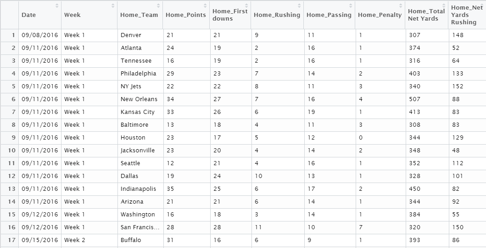
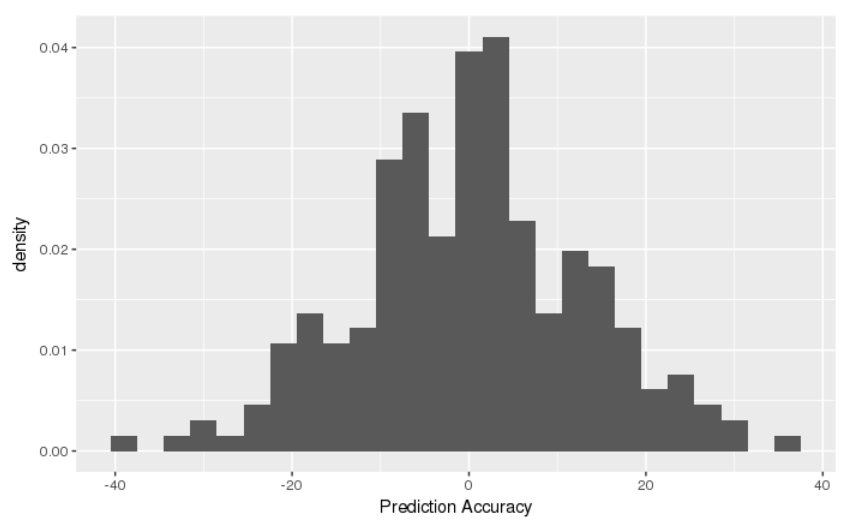
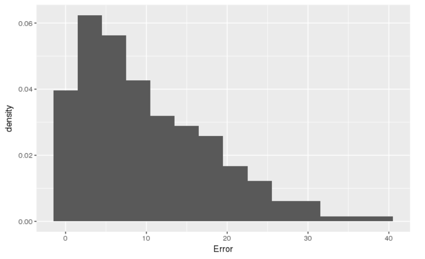
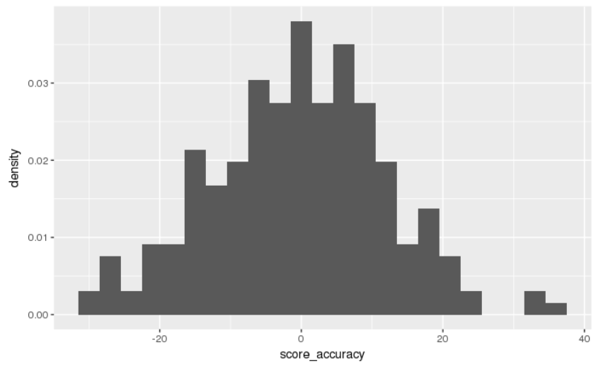
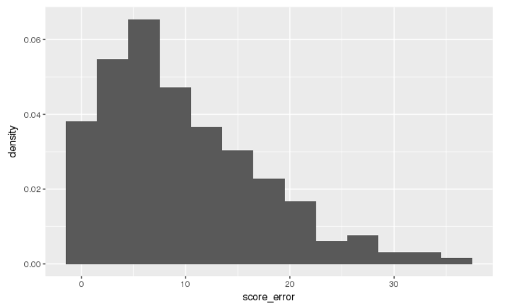
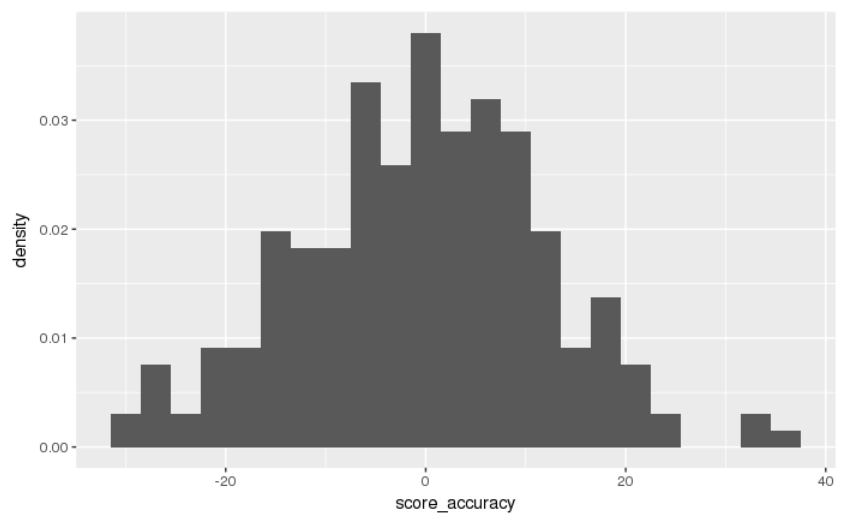
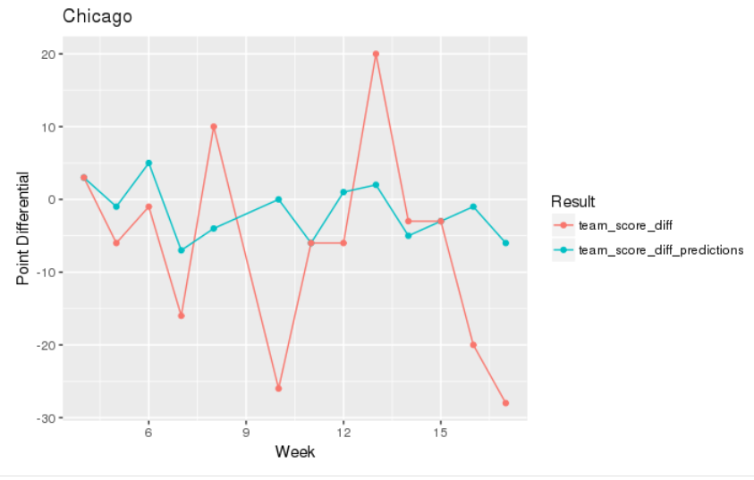
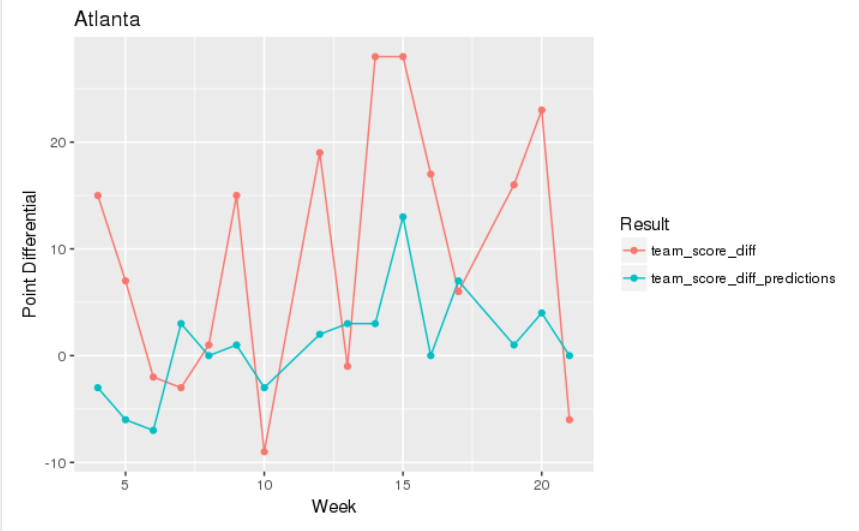
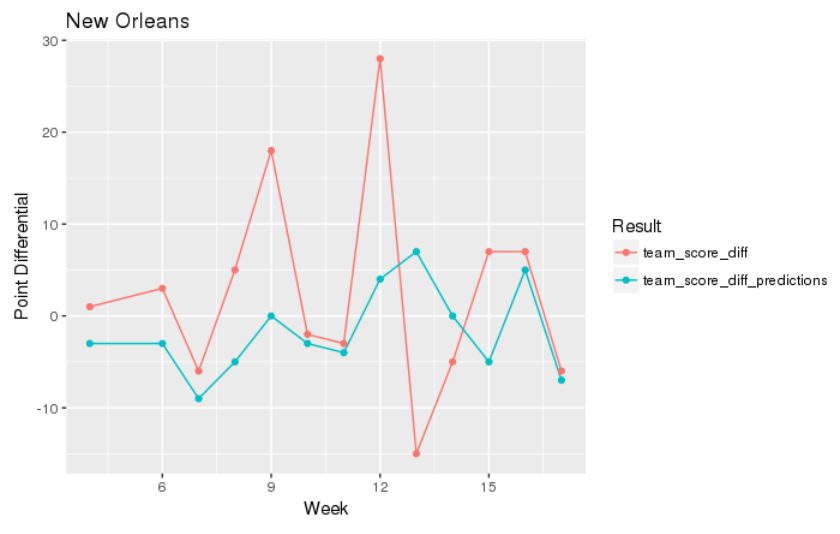
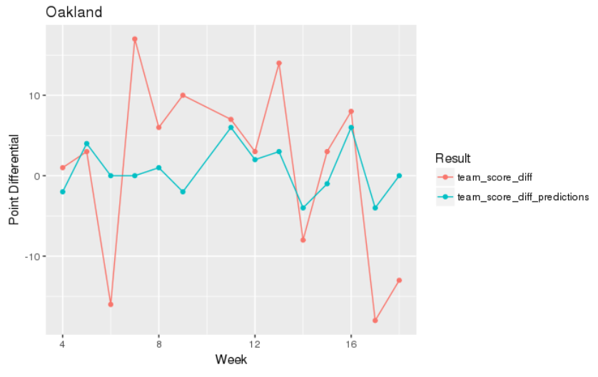

###Introduction/Motivation
American Football is a dynamic sport, anything can happen. At any moment, there are 22 players on the field playing different positions to reach one of thousands of objectives, and millions of results may be attained. Beyond all of this variety, it is one of America's favorite sports to watch and to try and predict. Predicting football outcomes is no easy task, but we were excited about the challenge and decided to try our hand at it. We took particular interest in attempting to model the score differential of NFL games, using distinct team offensive and defensive score stats that we calculated. We were specifically interested in seeing if these summary score statistics would act as effective predictors. Choosing to do a project like this was easy, because we are both big fans of the sport. If you wanted to see how we did, or to hear more about our methods, models, and findings, read on!


The literature that guided our work for the creation of the models was an article from the journal of Applied Statistics titled *Bayesian hierarchical model for the prediction of football results* by Gianluca Baio and Marta Blangiardo. This article was our primary building block for our model structure. Athough Baio and Blangiardo modeled regular football (soccer) scores, many of their ideas were transferable with a few modifications. They used a model called a Poisson log-normal, where the score $y_{jg}|\theta_{jg}$ was distributed based on a rate for each teams scoring ability $\theta_i$ in each of the two times they played $g$. These rates are then logged equations of similar offensive and defensive ability scores, each of which are normally distributed. They found their score predictions to be fairly accurate for the football clubs analyzed.

### Methods
Initially, we had to look at whether we wanted to work with team or individual stats. Given that individual stats were much more difficult to find and would include some obsolete info for non-skill players, we chose to work with team statistics. This created a contextualization problem of relating team stats to points scored. The solution came in the OD (offensive defensive) score model. The way this model works, is the offensive score of a team over a season is the sum of the ratio between all the points they score, and the points they allowed to be scored on them in each game. This set up helps to balance out an overweighted score from scoring a lot against a team that typically gives up a lot of points. The defensive scores are calculated the same way, as seen below. 
$$
o_{i,t} = \frac{s_{i,1}}{d_{1,t-1}} + \frac{s_{i,2}}{d_{2,t-1}} + \dots + \frac{s_{i,n}}{d_{n,t-1}} \\
d_{i,t} = \frac{s_{i,1}}{o_{1,t}} + \frac{s_{i,2}}{o_{n,t}} + \dots + \frac{s_{i,n}}{o_{n,t}} \\
\text{These scores can be updated with each new additional game as they hold the relationship} \\
o_t = A (1/d_{t-1}) \\
d_t = A (1/o_t) \\
$$


### The Data
A significant portion of this project was trying to get the data we want, in a way in which it was useful to use. It all started with scraping sections of two web pages from The Football Data Base website (www.footballdb.com). We scraped the data with R using the (xm12) package and the (rvest) packages. We used a google chrome extention called selector gadget to highlight the CSS code. In order to obtain game data beyond the boxscores, we found a pattern listed in the url of these pages that was organized by date and game number. From there we were able to loop in and go through and scrape those pages efficiently. We created a vector for the home and away data, and then compiled all the information into a dataframe. This worked effectively for every year except 2017, while the method should work with incomplete seasons, footballdb had some errors in their url date code that led us to Canadian football on one occasion. Thus, this project will not include 2017 data, but will include data from 2011 to 2016. All of this code was made in a function format so that we could input what year of data and we would recieve that year. R packages (dplyr) (tidyr) and (lubridate) were all necessary for acquiring the data. Table 1 below shows the first few columns of our raw data.

The second step of this process was Data wrangling. We needed to take the raw statistics scraped from the site, and transform them into the data we wanted to use. This was an extensive step that came in two shifts. The first was to make sure all the data was usable and that our data set only included variable statistics that we wanted. This included changing numeric stats to numeric values, breaking completion/attempts stats into attempts and completions separately, and obtaining correct week numbers including post season games, to name a few. The second shift was the formation of our Offensive and Defensive score statistics from the cleaned data. This was a detailed task that included mapping each team's offensive stats to the identified offensive team, and all defensive stats to the identified defensive team.

#####Table 1: Raw Data 



###Models & Results
After we had aquired and modified the data to our likeing, we began to construct some models that would best predict the score differential of an NFL game using rstudio's (rjags) package. Our models took on a Baysian approach, where we took prior understanding of some of our parameters to try and predict what the output may be, and adjusted that understanding with each new addition of data to the model. Our most basic model structure is similar to the literature by Baio and Blangiardo, we chose a Poisson model so that we can take a rate of points scored in a game, and record a count of points from it. However for Poisson models, the $E(\lambda)=Var(\lambda)$ and this does not reflect results that are accurate in variance. To solve this, we logged the $\lambda$ equation. Additionally, each of our models was trained on data from the 2011 to 2015 NFL seasons, before being tested on the 2016 season. For reference, Tables 2 and 3 below will provide a brief summary for each variable and parameter used in our models.

#####Table 2: Variable Values   
Variable                  |  Definition
------------------------  |  ----------------------------------------------
$y_{hi}$                  |  Home team final points scored in game i 
$y_{ai}$                  |  Away team final points scored in game i
$w_i$                     |  Binned weeks dividing each season into 3 uneven sections (early, mid, and late season
$hO_i$                    |  Home team's offensive score stat in game i
$hD_i$                    |  Home team's defensive score stat in game i
$aO_i$                    |  Away team's offensive score stat in game i
$aD_i$                    |  Away team's defensive score stat in game i
$hO_{i(y-1)}$             |  Home team's offensive score stat from last year
$hD_{i(y-1)}$             |  Home team's defensive score stat from last year
$aO_{i(y-1)}$             |  Away team's offensive score stat from last year
$aD_{i(y-1)}$             |  Away team's defensive score stat from last year

#####Table 3: Perameters         
Parameter            |  Definition
-------------------- |  ---------------------------------------------------------------------
$h\lambda_i$         |  The rate at which the home team scores points in a game i
$a\lambda_i$         |  The rate at which the away team scores points in a game i
$\beta_{1t}$         |  The weighting coefficient used to represent the relationship between the rate of points scored in game i                         and the difference of the offensive team score and the defensive team score. Weighted in higher models
$\beta_{2t}$         |  The weighting coefficient used to represent the relationship between the rate of points scored in game i                         and the difference of the home team's previous year offensive team score and the away team's previous                           year defensive team score. Weighted in higher models. 
$\beta_0$            |  The parameter which lists the logged y-intercept, or a base rate which points are scored if all                                 variables =0
$h_0$                |  The parameter which implements a home field advantage


####Model 1
Starting with this Bayesian structure, we came up with our first model:
$$
y_{hit}|h\lambda_{it},\beta_0,\beta_1,\beta_2,h_0 \sim Pois(h\lambda_{i}) \\
y_{ait}|a\lambda_{it},\beta_0,\beta_1,\beta_2 \sim Pois(a\lambda_i) \\
log(h\lambda_{it}) = \beta_0 + h_0 + \beta_{1}(hO_{it} - aD_{it}) \\
log(a\lambda_{it}) = \beta_0  + \beta_{1}(aO_{it} - hD_{it})  \\
\beta_0,h_0 \sim N(0,10) \\
\beta_{1} \sim N(1,10)  \\
$$
This model implies our basic model principles and looks at the logged rates $h\lambda$ and $a\lambda$ where they are being determined based on the difference of home and away team's offensive and defensive scores. Additionally, the coefficients $\beta0,\beta1, \text{and}\; h0$ all have very basic normally distributed priors, which allow for a greater majority of our understanding to come from the data we recieve. This model is considered our basic model because it only looks at a team's production over the course of the season, there is not much else accounted for as far as how good were they last year, or how they have improved or faltered since the begining of the season.

The results of our first model in Table 4 show how all of our parameters are in fact positvely correlated, but none of them look to hold any significance. When comparing our predictions to the actual outcomes of the games, we notice that our average prediction error was 10.10 points. As can be seen in Figures 1 and 2, wich show the spread of our predictions and the distribution of the prediction error, there are still a few games we missed by as much as 20 or even 40 on occasion. We looked to clean this up a bit in our next model.


#####Table 4: Model One Summary Stats

               2.5%       25%        50%       75%        97.5%
----------- ---------- ---------- ---------- ---------- ----------
 $\beta_0$     3.05       3.06      3.06       3.07       3.08   
 $\beta_1$     1.35       1.50      1.58       1.65       1.80 
 $h_0$         0.10       0.11      0.12       0.12       0.013
 
#####Figure 1


#####Figure 2



####Model 2
In our second model, we added two new $\beta_2$ parameters as well as pieces to our equation that would account for the team's performance incorporating last years OD score stats.
$$
y_{hit}|h\lambda_{it},\beta_0,\beta_1,\beta_2,h_0 \sim Pois(h\lambda_{i}) \\
y_{ait}|a\lambda_{it},\beta_0,\beta_1,\beta_2 \sim Pois(a\lambda_i) \\
log(h\lambda_{it}) = \beta_0 + h_0 + \beta_{1}(hO_{it} - aD_{it}) 
 + \beta_{2}(hO_{i(y-1)} - aD_{i(y-1)}) \\
log(a\lambda_{it}) = \beta_0  + \beta_{1}(aO_{it} - hD_{it})  
 + \beta_{2}(aO_{i(y-1)} - hD_{i(y-1)}) \\
\beta_0,h_0 \sim N(0,10) \\
\beta_{1},\beta_{2} \sim N(1,10)
$$
We felt this was a decent addition to the model because it now allowed us to see more team progression. If a team was historically bad last year, that may have an affect on how their team would perform coming into the next season. We simply mirrored the OD score difference between the home and away teams', offensive and defensive scores' from the current scores and added in a second one for their scores at the end of the last season. All prior distributions and external structure was kept from Model 1.
 
Looking at Model 2's results, we can see that the additional $\beta_2$ parameter on the historical team OD scores was significant. However, our average prediction error only fell to about 9.75 points. This is not a super significant change, but it does reflect that our decision to add in historic team data was a good one.

#####Table 5: Model Two Summary Stats
               2.5%       25%        50%       75%        97.5%
----------- ---------- ---------- ---------- ---------- ----------
 $\beta_0$     3.05       3.06      3.06       3.06       3.07   
 $\beta_1$     1.04       1.21      1.29       1.37       1.52 
 $\beta_2$    10.59      11.25     11.60      11.96      12.63
 $h_0$         0.10       0.11      0.11       0.12       0.013


#####Figure 3
 

#####Figure 4



####Model 3
For our final model, we made one more addition from Model 2 that would help measure how a team progresses throughout the season. By introducing a weight distribution for each $\beta_1$ and $\beta_2$  that would be normally distributed based on what part of the season they were in $t\in(1:3).
$$
y_{hit}|h\lambda_{it},\beta_0,\beta_1,\beta_2,h_0 \sim Pois(h\lambda_{i}) \\
y_{ait}|a\lambda_{it},\beta_0,\beta_1,\beta_2 \sim Pois(a\lambda_i) \\
log(h\lambda_{it}) = \beta_0 + h_0 + \beta_{1b_t}(hO_{it} - aD_{it}) 
 + \beta_{2b_t}(hO_{i(y-1)} - aD_{i(y-1)}) \\
log(a\lambda_{it}) = \beta_0  + \beta_{1b_t}(aO_{it} - hD_{it})  
 + \beta_{2b_t}(aO_{i(y-1)} - hD_{i(y-1)}) \\
\beta_0,h_0 \sim N(0,10) \\
\beta_{1t},\beta_{2t} \sim N(1,10) \; \text{for}\; b_t \in (1,3)
$$
This addition to the model was worthwhile because now, the rate of scoring is influenced by the OD scores from the current and past seasons, at varying parts of the season. When $\beta_1$ and $\beta_2$ are weighted for season section $t$, the predictions are able to reflect if a team's ability to score points is greater or worse at a specific part of a season, or even season to season, with the Model 2 addition. This inclusion of team trend seemed like a great addition to create our final model.

Looking at the results of our MCMC model generation. We can see evidence of what we were looking for in our Model 3. The $\beta_1$'s show more and more significance as the current season plays out, while the $\beta_2$'s show less significance as the season plays out. This is to be expected because our model relied heavily on last years OD scores when making predictions early in the season, but as the season went on, turned more towards the current trending OD scores. The average prediction error for this model only fell to 9.73 points. This wasn't significantly greater than our Model 2 result, but still managed to show improvement.

#####Table 6: Model Three Summary Stats
                  2.5%       25%        50%       75%        97.5%
-------------- ---------- ---------- ---------- ---------- ----------
 $\beta_0$         3.04       3.05      3.05       3.06       3.07   
 $\beta_{1,1}$     0.27       0.46      0.56       0.66       0.85 
 $\beta_{1,2}$     5.93       6.85      7.35       7.85       8.82
 $\beta_{1,3}$    13.94      14.87     15.35      15.83      16.77
 $\beta_{2,1}$     8.96      10.39     11.14      11.89      13.32
 $\beta_{2,2}$     8.31       9.51     10.18      10.84      12.06
 $\beta_{2,3}$     2.95       3.91      4.40       4.92       5.93
 $h_0$             0.10       0.11      0.11       0.12       0.13


#####Figure 5
 

#####Figure 6


Additional results we wanted to look at for this final model was how the predictions of point spreads vs actual outcomes turn out when looking at specific teams. Here's some of what we found:
#####Figure 7

For Chicago, the predictions were fairly stable and consistant throughout, but there was a string of blowouts over the season that through our accuracy off.

#####Figure 8


In Atlanta's case, they were not very good in previous years, so their predictions were low. But they won many of their early games, many by blowouts. They would eventually move on to play in the Super Bowl this year, but it is worth noting here how our model was able to increase predictions based on the season performance.

#####Figure 9


New Orleans demonstrates how our model does in theory, we were very close on predicting many of the games, but there were a few unanticipated blowout games that shook up the overall results.

#####Figure 10


Looking at Oaklands data, we can see that the predictions were decent (with the exception of a few blowouts) in the early to middle part of the season, but after week 16, Oakland's best offensive player got injured. Our model is not accustomed to react fast enough to this shock and thus predicted a much closer margin than the actual results for the remaining games.


### Limitations
While we did see some improvement in our modeling, and managed to generate prediction spreads of less than 10 points on average, there is still a lot  we could improve upon it. One of the primary limitations of this model is the limited data. With a model such as this, you need to be pulling target points from a far greater number of sources than just a few years worth of games. With the NFL only being 32 teams, and only playing a regular season of 16 games, it is difficult to get an effective quanitity of data. Adding additional parameters is also an improvement that is handcuffed by the lack of availability. There are only so many parameters we can include in which we have enough data to represent them effectively.

Additionally, as we saw across the results section, our model is very slow to respond to major shocks such as injury. This is very difficult to model, as is trying to represent the playmaking ability of a team or player that would contribute to a blowout game. These aspects of the sport are what make it so difficult for anyone to model in the first place. These are the parts of our model that if we could simply look to limit, we would improve our predictions greatly.

Finally, our model does not account for the changes that occur within teams from season to season. Many players may retire, switch teams, and new prodigies may be drafted. The entire dynamic of a team could change in an offseason. While we did incorporate a way to inlude past years team stats into current day projections, the model will not make significant adjustments to this quick enough.

###Whats next
Given the opportunity to continue this research and work more with this data to develop even better prediction models, there are a few things we would like to explore to either make the model just a little bit better, or satisfy our own curiosity about the model or the data. One of the first things we would do is look to modify the priors used in each of our models. Many of these priors are very generic and, thus, weighted heavily on the data for its predictability. Ideally there would be some greater research or intuition there to experiment and find a more solid prior distribution. Another thing we would like to do is see how this model predicts the score differential of other sports. Most sports have some sort of attack and defense aspect that can be modeled with the OD model system. Theoretically, this should be applicable to any sport.


###Bibliography

#####Literature
Gianluca Baio and Marta Blangiardo, *Bayesian hierarchical model for the prediction of football results*, journal of Applied Statistics, Vol. 37, No. 2, February 2010, 253–264, November 2017.

#####Rstudio Packages
library(xml2)
library(rvest)
library(tidyr)
library(dplyr)
library(ggplot2)
library(lubridate)
library(readr)
library(igraph)
library(rjags)

#####Data Sources
www.footballdb.com

#####Other
Google Chrome Selector Gadget


###Apendix and Code


```{r}
library(xml2)
library(rvest)
library(tidyr)
library(dplyr)
library(ggplot2)
library(lubridate)
```


https://www.rstudio.com/wp-content/uploads/2015/02/data-wrangling-cheatsheet.pdf


##2015 Team & Score Data (first webpage)
```{r}
url2015 <- 'http://www.footballdb.com/games/index.html?lg=NFL&yr=2015'
webpage2015 <- read_html(url2015)

date15_html <- html_nodes(webpage2015,'td:nth-child(1) .hidden-xs')
date15_data <- html_text(date15_html)

visitteam15_html <- html_nodes(webpage2015,'td:nth-child(2) .hidden-xs')
visitteam15_data <- html_text(visitteam15_html)

visitscore15_html <- html_nodes(webpage2015,'#leftcol .center:nth-child(3)')
visitscore15_data <- html_text(visitscore15_html)
visitscore15_data <-as.numeric(visitscore15_data)

hometeam15_html <- html_nodes(webpage2015,'.center+ td > .hidden-xs')
hometeam15_data <- html_text(hometeam15_html)

homescore15_html <- html_nodes(webpage2015,'.center:nth-child(5)')
homescore15_data <- html_text(homescore15_html)
homescore15_data <-as.numeric(homescore15_data)

fbscores2015 <- data.frame(Date = date15_data, Visiting_Team = visitteam15_data, Visiting_Score = visitscore15_data, Home_Team = hometeam15_data, Home_Score = homescore15_data)
#fbscores2015
```

##2016 Team & Score Data 
```{r}
url2016 <- 'http://www.footballdb.com/games/index.html?lg=NFL&yr=2016'
webpage2016 <- read_html(url2016)

date16_html <- html_nodes(webpage2016,'td:nth-child(1) .hidden-xs')
date16_data <- html_text(date16_html)

visitteam16_html <- html_nodes(webpage2016,'td:nth-child(2) .hidden-xs')
visitteam16_data <- html_text(visitteam16_html)

visitscore16_html <- html_nodes(webpage2016,'#leftcol .center:nth-child(3)')
visitscore16_data <- html_text(visitscore16_html)
visitscore16_data <-as.numeric(visitscore16_data)

hometeam16_html <- html_nodes(webpage2016,'.center+ td > .hidden-xs')
hometeam16_data <- html_text(hometeam16_html)

homescore16_html <- html_nodes(webpage2016,'.center:nth-child(5)')
homescore16_data <- html_text(homescore16_html)
homescore16_data <-as.numeric(homescore16_data)

fbscores2016 <- data.frame(Date = date16_data, Visiting_Team = visitteam16_data, Visiting_Score = visitscore16_data, Home_Team = hometeam16_data, Home_Score = homescore16_data)
#fbscores2016
```

##2017 Team & Score Data 
```{r}
url2017 <- 'http://www.footballdb.com/games/index.html?lg=NFL&yr=2017'
webpage2017 <- read_html(url2017)

date17_html <- html_nodes(webpage2017,'td:nth-child(1) .hidden-xs')
date17_data <- html_text(date17_html)
date17_data <- as.Date(date17_data,"%m/%d/%Y")

visitteam17_html <- html_nodes(webpage2017,'td:nth-child(2) .hidden-xs')
visitteam17_data <- html_text(visitteam17_html)

visitscore17_html <- html_nodes(webpage2017,'#leftcol .center:nth-child(3)')
visitscore17_data <- html_text(visitscore17_html)
visitscore17_data <-as.numeric(visitscore17_data)

hometeam17_html <- html_nodes(webpage2017,'.center+ td > .hidden-xs')
hometeam17_data <- html_text(hometeam17_html)

homescore17_html <- html_nodes(webpage2017,'.center:nth-child(5)')
homescore17_data <- html_text(homescore17_html)
homescore17_data <-as.numeric(homescore17_data)

fbscores2017 <- data.frame(Date = date17_data, Visiting_Team = visitteam17_data, Visiting_Score = visitscore17_data, Home_Team = hometeam17_data, Home_Score = homescore17_data)
#fbscores2017
```

```{r}
date_html <- html_nodes(webpage2017,'td:nth-child(1) .hidden-xs , .divheader')
date_data <- html_text(date_html)
#date_data

week <- rep(0,256)
if (date17_data >= "2017-09-14") week=1 else week=0
mutate(fbscores2017, Week=week)

#date17_data
#week <- rep(0,50)

```


```{r}
url <- "http://www.footballdb.com/games/boxscore.html?gid=2017091001"

#Reading the HTML code from the website
webpage <- read_html(url)

title_data_html <- html_nodes(webpage,"#divBox_team tbody .left")
title_data <- html_text(title_data_html)
title_data <- append(c("Team", "Points"), title_data)

# #Create boxscore 
# boxscore <- data.frame(Category = title_data, Home = home_data, Away = away_data)

#Create game event (single row that describes game)
home_variables <- paste0(rep("Home_",length(title_data)),title_data)
away_variables <- paste0(rep("Away_",length(title_data)),title_data)
event_variables <- append(home_variables,away_variables)
event_variables <- append(c("Date","Week"),event_variables)

length(event_variables)

```

```{r}
createDateVector <- function(year){
  url <- paste0('http://www.footballdb.com/games/index.html?lg=NFL&yr=',toString(year))
  webpage <- read_html(url)
  date_html <- html_nodes(webpage,'td:nth-child(1) .hidden-xs')
  date_data <- html_text(date_html)
  dateVect <- as.Date(date_data,"%m/%d/%Y")
  
  today = today()
  daysBeforeToday = dateVect <today
  dateVect = dateVect[daysBeforeToday]
}
```

```{r}
dateToURL <- function(dateVect, i, adjustment=0){
  url_base <- 'http://www.footballdb.com/games/boxscore.html?gid='
  url_year = year(dateVect[i])
  if(month(dateVect[i])<10){
    url_month <- paste0("0",month(dateVect[i]))
  }else{
    (url_month <-toString(month(dateVect[i])))
   }
  if(day(dateVect[i])<10){
    url_day <- paste0("0",day(dateVect[i]))
  }else{
    url_day <-toString(day(dateVect[i]))
  }
  
  gameNum = 1
  location = i-1
  if(location >0){
    while(dateVect[i]==dateVect[location]){
      gameNum = gameNum+1
      location=location-1
      
      if(location==0){
        break
      }
    }
  }
  
  gameNum = gameNum + adjustment
  
  if(gameNum<10){
    url_gamenum <- paste0("0",toString(gameNum))
  }else{
    url_gamenum <-toString(gameNum)
  }

  url <- paste0(url_base,url_year,url_month,url_day,toString(url_gamenum))

  
  return(list(url=url,url_year=url_year,url_month = url_month,url_day=url_day))
}
```
```{r}
yearlyStats <- function(dateVect){
  data = matrix(rep('',length(event_variables)),nrow=1)
  
  for(i in 1:length(dateVect)){


    url_info <- dateToURL(dateVect,i)
    url <- url_info$url
    
    webpage <- read_html(url)
  
  
    away_data_html <- html_nodes(webpage,'#divBox_team .row1 .left+ td , .section_left .left+ td .hidden-xs , #divBox_team .row0 .left+ td')
    away_data <- html_text(away_data_html)
    away_points <- html_text(html_nodes(webpage,'#leftcol .header+ .center td+ td b'))
    away_data <- append(away_data,away_points, after = 1)
  
    home_data_html <- html_nodes(webpage,"#divBox_team .row1 .left~ td+ td , #divBox_team .row0 .left~ td+ td , .section_left .left~ td+ td .hidden-xs")
    home_data <- html_text(home_data_html)
    home_points <- html_text(html_nodes(webpage,'#leftcol .row0+ .center td+ td b'))
    home_data <- append(home_data,home_points, after = 1)
    
    week_info <- html_text(html_nodes(webpage,'#breadcrumbs a~ a+ a'))
  
    date = paste0(url_info$url_month,"/",url_info$url_day,"/",url_info$url_year)
    date = append(date,week_info)
    game_data = append(date,home_data)
    game_data = append(game_data,away_data)
    
    
    
    adjustment = 1
    while(length(game_data)==2 |length(game_data)==1){
      url <- dateToURL(dateVect,i,adjustment = adjustment)$url
    
      webpage <- read_html(url)
    
      away_data_html <- html_nodes(webpage,'#divBox_team .row1 .left+ td , .section_left .left+ td .hidden-xs , #divBox_team .row0 .left+ td')
      away_data <- html_text(away_data_html)
      away_points <- html_text(html_nodes(webpage,'#leftcol .header+ .center td+ td b'))
      away_data <- append(away_data,away_points, after = 1)
    
      home_data_html <- html_nodes(webpage,"#divBox_team .row1 .left~ td+ td , #divBox_team .row0 .left~ td+ td , .section_left .left~ td+ td .hidden-xs")
      home_data <- html_text(home_data_html)
      home_points <- html_text(html_nodes(webpage,'#leftcol .row0+ .center td+ td b'))
      home_data <- append(home_data,home_points, after = 1)
      
      week_info <- html_text(html_nodes(webpage,'#breadcrumbs a~ a+ a'))

    
      date = paste0(url_info$url_month,"/",url_info$url_day,"/",url_info$url_year)
      date = append(date,week_info)
      game_data = append(date,home_data)
      game_data = append(game_data,away_data)
    
      adjustment = adjustment+1
    
    
      if(adjustment >100){
        print("ERROR: ADJUSTMENT TOO LARGE")
        print(i)
        break
      }
  
    }
    data = rbind(data,game_data)
  
  }
  return(data)
}
```
```{r}
createDataframe <- function(year){
  dateVect = createDateVector(year)
  data_mat = yearlyStats(dateVect)
  data_mat = data_mat[-1,]
  game_stats <- data.frame(data_mat)
  names(game_stats)[1:length(event_variables)] <- event_variables
  names(game_stats)[c(12,40)] <- c('Home_Avg Rush Gain','Away_Avg Rush Gain')
  return(game_stats)
    
}
```
```{r}
 game_stats_2010 <- createDataframe(2010)
game_stats_2010<- game_stats_2010[-c(208,240),]

game_stats_2011 <- createDataframe(2011)
 game_stats_2012 <- createDataframe(2012)
game_stats_2013 <- createDataframe(2013)
game_stats_2014 <- createDataframe(2014)
game_stats_2014<- game_stats_2014[-176,]
game_stats_2015 <- createDataframe(2015)
game_stats_2016 <- createDataframe(2016)
# game_stats_2017 <- createDataframe(2017)
#View(game_stats_2010)
```
```{r}
# date_2017 <- createDateVector(2017)
# dateToURL(date_2017,length(date_2017)-1)


```

```{r}
library(tidyr)
library(dplyr)
library(ggplot2)
library(lubridate)
library(readr)
library(igraph)
```
### Functions
```{r}
modifyWeek <- function(dataframe){
#Modifies week variable from a string to a number
  modifiedData <- dataframe
  week <- dataframe$`Week`
  
  weekNum <- extract_numeric(week)
  wildcard <- grepl("Wild",week)
  division <- grepl("Divisional",week)
  conference <- grepl("Conference",week)
  super <- grepl("Super",week)

  for(i in 1:length(weekNum)){
    if(is.na(weekNum[i])){
      if(wildcard[i]){
        weekNum[i] <- 18
      } else if(division[i]){
        weekNum[i]<-19
      } else if(conference[i]){
        weekNum[i]<-20
      } else if(super[i]){
        weekNum[i] <-21
      }
    }
  }
  
  modifiedData$`Week` <- weekNum
  return(modifiedData)
}

simplify <- function(dataframe){
#Modifies the full dataset to only include columns of interest
 
   modifiedData <- dataframe %>%  
    select(Date:Home_Points,contains('Home_Net Yards Rushing'):contains('Home_Avg. Yds/Att'),Away_Team,Away_Points,contains('Away_Net Yards Rushing'):contains('Away_Avg. Yds/Att'),-contains('Home_Sacked'):-contains('Home_Gross'),-contains('Away_Sacked'):-contains('Away_Gross')) %>%
    separate(`Away_Att - Comp - Int`,c('Away_Att','Away_Comp','Away_Int')) %>%
    separate(`Home_Att - Comp - Int`,c('Home_Att','Home_Comp','Home_Int')) %>%
    select(-`Home_Comp`,-`Home_Int`,-`Away_Comp`,-`Away_Int`) 
 

  
  #Converts vectors that are not numbers to characters
  modifiedData[,c(1,3,11)] <- data.frame(apply(modifiedData[,c(1,3,11)], 2, as.factor))
  modifiedData[,c(1,3,11)] <- data.frame(apply(modifiedData[,c(1,3,11)], 2, as.character))

  
  #Converts vectors that contain numbers to type double
  numVectors = (1:ncol(modifiedData))[-c(1,2,3,11)]
  modifiedData[,numVectors] <- data.frame(apply(modifiedData[,numVectors], 2, as.factor))
  modifiedData[,numVectors] <- data.frame(apply(modifiedData[,numVectors], 2, as.numeric))
  
  
  


  
  #Adjust Average Passing Yards/Attempt Stat to Net yards, not Gross yards
  modifiedData$`Home_Pass Gain/Att` = modifiedData$`Home_Net Yards Passing`/modifiedData$`Home_Att`
  modifiedData$`Away_Pass Gain/Att` = modifiedData$`Away_Net Yards Passing`/modifiedData$`Away_Att`
  
  modifiedData <- modifyWeek(modifiedData)
  modifiedData <- modifiedData[,c(1:9,19,11:17,20,10,18)]
  modifiedData <- modifiedData[,-c(19,20)]
  
  modifiedData <- modifiedData %>%
    mutate_each_( funs(as.character(.)), names( .[,sapply(., is.factor)] ))

  return(modifiedData)
}
```
```{r}
dataToGraph <- function(dataframe,week,stat){
#Convert the season data to a graph format
#week is the last week that you have data for i.e. use week = 7 to make predictions for week 8
#stat is the column number of the home stat that you want to observe
  
  homeCol = stat
  awayCol = stat + 8
  
  modifiedData <- dataframe %>%
    filter(Week < week) %>%
    select(Home_Team,Away_Team,homeCol,awayCol) 
  
  home_data = modifiedData[,-c(4)]
  colnames(home_data)[3] = 'weight'
  away_data = modifiedData[,c(2,1,4,3)]
  away_data = away_data[,-c(4)]
  colnames(away_data)[3] = 'weight'

  
  h = graph.data.frame(home_data,directed = TRUE)
  h$weight <- home_data[,3]
  a = graph.data.frame(away_data,directed=TRUE)
  a$weight <- away_data[,3]
  
  g = union(h,a)
  
  E(g)$weight_1[is.na(E(g)$weight_1)]<-0
  E(g)$weight_2[is.na(E(g)$weight_2)]<-0
  E(g)$weight <- E(g)$weight_1 +E(g)$weight_2
  
  g<- delete_edge_attr(g,'weight_1')
  g<- delete_edge_attr(g,'weight_2')

  
  return(g)
}
```
```{r}
initOffenseDefense = function(graph) {
  num_vertices = length(V(graph))
  offense = rep(1,num_vertices)
  defense = rep(1,num_vertices)
  list(offense=offense,defense=defense)
}


```

```{r}

update = function(A,o,games_ratios) {
  (t(A) %*% (1/(games_ratios*(A %*% (1/o)))))* games_ratios 
}

run_alg = function(A,o,games_ratios,epsilon = 0.5*10^-4) {
  diff = Inf
  while(diff > epsilon) {
    new_o = update(A,o,games_ratios)
    diff = sqrt(t(new_o - o) %*% (new_o - o))
    o = new_o
  }
  return(o)
}

get_games_ratios = function(g) {
  max(degree(g))/degree(g)
}
get_defense = function(A,o,games_ratios) {
  (A %*% (1/o)) * games_ratios
}


calculateOD <- function(g, e = .5*10^-5){
  #initialize offense vectors to have every team with an offensive score of 1
  offense = rep(1,length(V(g)))
  
  Adj = as.matrix(get.adjacency(g,attr='weight'))
  Adj = Adj + e*(offense %*% t(offense) - diag(length(V(g))))
  Adj = t(Adj)

  games_ratios = get_games_ratios(g)
  
  final_offense = run_alg(Adj, offense,games_ratios,epsilon = e)
  final_defense = get_defense(Adj,final_offense,games_ratios)
  
  # offenseVect = final_offense - mean(final_offense)
  offenseVect =final_offense / sum(final_offense)
  offenseVect = offenseVect - mean(offenseVect)
  # offenseVect = offenseVect[order(offenseVect,decreasing = TRUE),,drop=FALSE]
  
  defenseVect = 1/(final_defense) 
  defenseVect = defenseVect/sum(defenseVect)
  defenseVect = defenseVect - mean(defenseVect)
  # defenseVect = defenseVect[order(defenseVect,decreasing = TRUE),,drop=FALSE]
  
  return(list(offense = offenseVect, defense = defenseVect))
}

createODDF <- function(rawData){
  data <- simplify(rawData)

  teamData <- data.frame()
  
  #calculate OD 
  columns = c(5,7,8,10)
  for(i in 2:max(data$Week)){
  #Create DF based on OD for points
    OD <- calculateOD(dataToGraph(data,i,4))
    offense <-OD$offense
    defense <- OD$defense
    
    week = rep(i,length(offense))
    teams <- names(offense[,1])
    
    weeklyDF <- data.frame(week,teams,offense,defense)

    for(j in columns){
    #Expand this DF to include OD for other stats
      OD <- calculateOD(dataToGraph(data,i,j))
      offense <-OD$offense
      defense <- OD$defense
      
      week = rep(i,length(offense))
      teams <- names(offense[,1])
      w <- data.frame(week,teams,offense,defense)
      
      weeklyDF <- weeklyDF %>%
        left_join(w,by= c("week"="week","teams" = "teams"))
    }
    
    teamData <- teamData %>%
      bind_rows(weeklyDF)
  }
  
  colnames(teamData) <- c("Week",'Team',"O_Points","D_Points","O_Net Rush","D_Net Rush","O_Avg Rush","D_Avg Rush","O_Net Pass",'D_Net Pass','O_Avg Pass','D_Avg Pass')
  
  return(teamData)
}


# OD_2016 <-createODDF(game_stats_2016)
# View(OD_2016)
```
```{r}
# g = dataToGraph(data_2016,23,6)
# Adj = as.matrix(get.adjacency(g,attr='weight'))
```


```{r}
createOffensiveData <- function(gameData){
  
  homeData = gameData[,c(1:10)]
  awayData = gameData[,c(1:2,11:18)]
  
  home_names = c(colnames(homeData)[1:2],unlist(strsplit(colnames(homeData[3:length(colnames(homeData))]), split='_', fixed=TRUE))[seq(2,16,by=2)])
  colnames(homeData) = home_names
  colnames(awayData) = home_names
  
  modifiedData = bind_rows(awayData,homeData)
  
  modifiedData <- modifiedData %>%
    group_by(Team) %>%
    arrange(Team,Week) %>%
    mutate(`cumavg rush` = cummean(`Avg Rush Gain`)) %>%
    mutate(`cumavg pass` = cummean(`Pass Gain/Att`)) %>%
    mutate(`cumavg total rush` = cummean(`Net Yards Rushing`)) %>%
    mutate(`cumavg total pass` = cummean(`Net Yards Passing`)) %>%
    mutate('Next Week' = `Week`+1 )
  
  modifiedData <- modifiedData[,-c(4:10)]
  modifiedData <- modifiedData[,c(8,3:7,1:2)]
  modifiedData <-modifiedData[,-c(7:8)]
  
  colnames(modifiedData)[3:6] = paste0("Offense ", colnames(modifiedData)[3:6])
  
  
  
  #Missing infrormation for after the team's bye week
  for(i in 2:nrow(modifiedData))
    if(modifiedData$`Next Week`[i-1] + 2 == modifiedData$`Next Week`[i]){
      newRow = modifiedData[i-1,]
      newRow$`Next Week` = modifiedData[i-1,]$`Next Week` +1
      
      modifiedData <- bind_rows(modifiedData,newRow)
    }
  
  modifiedData <- modifiedData %>% 
    arrange(Team,`Next Week`)

  
  
  return(modifiedData)
}
```
```{r}
createDefensiveData <- function(gameData){
  homeData = gameData[,c(1:3,12:18)]
  awayData = gameData[,c(1:2,11,4:10)]
  
  home_names = c(colnames(homeData)[1:2],unlist(strsplit(colnames(homeData[3:length(colnames(homeData))]), split='_', fixed=TRUE))[seq(2,16,by=2)])
  colnames(homeData) = home_names
  colnames(awayData) = home_names

  modifiedData = bind_rows(awayData,homeData)

  modifiedData <- modifiedData %>%
    group_by(Team) %>%
    arrange(Team,Week) %>%
    mutate(`cumavg rush` = cummean(`Avg Rush Gain`)) %>%
    mutate(`cumavg pass` = cummean(`Pass Gain/Att`)) %>%
    mutate(`cumavg total rush` = cummean(`Net Yards Rushing`)) %>%
    mutate(`cumavg total pass` = cummean(`Net Yards Passing`)) %>%
    mutate('Next Week' = `Week`+1 )

  modifiedData <- modifiedData[,-c(4:10)]
  modifiedData <- modifiedData[,c(8,3:7,1:2)]
  modifiedData <-modifiedData[,-c(7:8)]
  
  colnames(modifiedData)[3:6] = paste0("Defense ", colnames(modifiedData)[3:6])


  #Missing infrormation for after the team's bye week
  for(i in 2:nrow(modifiedData))
    if(modifiedData$`Next Week`[i-1] + 2 == modifiedData$`Next Week`[i]){
      newRow = modifiedData[i-1,]
      newRow$`Next Week` = modifiedData[i-1,]$`Next Week` +1

      modifiedData <- bind_rows(modifiedData,newRow)
    }

  modifiedData <- modifiedData %>%
    arrange(Team,`Next Week`)

  
  
  return(modifiedData)
}

createTeamData <- function(gameData){
  defenseData <- createDefensiveData(gameData)
  offenseData <- createOffensiveData(gameData)
  
  teamData <- offenseData %>%
    left_join(defenseData, by= c("Next Week"="Next Week","Team" = "Team"))
  
  return(teamData)


}

```


```{r}
createModelDF <- function(rawDataframe, prevYearRawDataframe){
  game_data <- simplify(rawDataframe)
  

  
  OD_dataframe <- createODDF(rawDataframe) %>%
      select(Week,Team,contains("O_"),contains("D_"))
  
  prev_OD_dataframe <- createODDF(prevYearRawDataframe) %>%
    select(Week,Team,contains("Points")) %>%
    filter(Week>20) %>%
    rename(`O_Points_Last_Year` = O_Points) %>%
    rename(`D_Points_Last_Year` = D_Points) %>%
    select(-Week)    

  
  
  OD_dataframe$Team = as.character(OD_dataframe$Team)
  prev_OD_dataframe$Team = as.character(prev_OD_dataframe$Team)
  
  #Account for team name changes
  oldTeam = "St. Louis"
  newTeam = "Los Angeles"

  game_data[ game_data == oldTeam ] <- newTeam
  OD_dataframe[OD_dataframe==oldTeam]<- newTeam
  prev_OD_dataframe[prev_OD_dataframe==oldTeam]<-newTeam
  
  
  
  game_id = data.frame(1:nrow(game_data))
  
  team_names <- game_data %>%
    group_by(Home_Team) %>%
    summarise() 
  
  colnames(team_names)<- "Team"
  
  team_id = data.frame(1:nrow(team_names))
  
  team_ids <- bind_cols(team_names,team_id)
  home_ids <- team_ids 
  colnames(home_ids)[2] = "Home_id"
  away_ids <- team_ids
  colnames(away_ids)[2] = "Away_id"
  game_data <- game_data %>%
    left_join(home_ids,by = c("Home_Team" = "Team")) %>%
    left_join(away_ids,by = c("Away_Team"= "Team")) %>% 
    select(Date,Week,Home_Team,Home_id,Home_Points,Away_Team,Away_id,Away_Points)
  

  

  
  
  H_data <- OD_dataframe 
  A_data <- OD_dataframe
  
  H_prev <- prev_OD_dataframe
  A_prev <- prev_OD_dataframe
  
  colnames(H_data)[1:ncol(H_data)] <- paste0("Home_",colnames(H_data)[1:ncol(H_data)])
  colnames(A_data)[1:ncol(A_data)] <- paste0("Away_",colnames(A_data)[1:ncol(A_data)])
  
  colnames(H_prev)[1:ncol(H_prev)] <- paste0("Home_",colnames(H_prev)[1:ncol(H_prev)])
  colnames(A_prev)[1:ncol(A_prev)] <- paste0("Away_",colnames(A_prev)[1:ncol(A_prev)])
  
  
  game_data <- game_data %>%
    bind_cols(game_id) %>%
    left_join(H_data,by = c("Week" = "Home_Week", "Home_Team"="Home_Team")) %>%
    left_join(H_prev,by = c("Home_Team"="Home_Team")) %>%
    left_join(A_data,by = c("Week" = "Away_Week", "Away_Team"="Away_Team")) %>%
    left_join(A_prev,by = c("Away_Team"="Away_Team")) %>%
    select(Date,Week,contains("Home_"),contains("Away_")) %>%
    filter(Week >3) %>%
    arrange(Week,Home_Team)
  
  binnedWeeks <- rep(0, nrow(game_data))
  weeks <- game_data$Week
  # for(i in 1:length(weeks)){
  #   if(weeks[i]>=1 & weeks[i]<=5){
  #     binnedWeeks[i]=1
  #   } else if(weeks[i]>=6 & weeks[i]<=10){
  #     binnedWeeks[i] = 2
  #   } else if(weeks[i]>=11 & weeks[i] <=14){
  #     binnedWeeks[i] = 3
  #   } else{
  #     binnedWeeks[i] = 4
  #   }
  # }
  
  for(i in 1:length(weeks)){
    if(weeks[i]>=1 & weeks[i]<=5){
      binnedWeeks[i] = 1
    } else if(weeks[i]>=5 & weeks[i] <=10){
      binnedWeeks[i] = 2
    } else{
      binnedWeeks[i] = 3
    }
  }
  binnedWeeks <-data.frame(binnedWeeks)
  colnames(binnedWeeks)<- "binnedWeeks"
  
  game_data <- bind_cols(game_data,binnedWeeks)
  
  return(game_data)
}


# View(createModelDF(game_stats_2016,game_stats_2015))
# View(createModelDF(game_stats_2015,game_stats_2014))


```


write.csv(modelDF2016,"modelData2016.csv")


```{r}
# data_2014 <-simplify(game_stats_2016)
# data_2015 <-simplify(game_stats_2016)
# data_2016 <-simplify(game_stats_2016)
# data_2017 <-simplify(game_stats_2016)

 modelDF2011 <- createModelDF(game_stats_2011,game_stats_2010)
 modelDF2012 <- createModelDF(game_stats_2012,game_stats_2011)
 modelDF2013 <- createModelDF(game_stats_2013,game_stats_2012)
 modelDF2014 <- createModelDF(game_stats_2014,game_stats_2013)
 modelDF2015 <- createModelDF(game_stats_2015,game_stats_2014)
 modelDF2016 <- createModelDF(game_stats_2016,game_stats_2015)
# modelDF2017 <- createModelDF(game_stats_2017,game_stats_2016)
```

```{r} 
#Data filtered to later weeks to avoid noise

modelData <-modelDF2015 %>% 
  bind_rows(modelDF2014) %>%
  bind_rows(modelDF2013) %>%
  bind_rows(modelDF2012) %>%
  bind_rows(modelDF2011)

```


```{r}
library(tidyr)
library(dplyr)
library(ggplot2)
library(lubridate)
library(readr)
library(igraph)
library(rjags)

```
```{r}
score_diff <- "model{
  #Data
  for(i in 1:length(H_pts)) {
    H_pts[i] ~ dpois(H_lam[i])
    A_pts[i] ~ dpois(A_lam[i])
  
    log(H_lam[i]) <- b0+ h0 + b1*(h_O[i] - a_D[i])
    log(A_lam[i]) <- b0 + b1*(a_O[i] - h_D[i]) 
  }
  
  #Priors
  h0 ~ dnorm(0,1/10)

  b0 ~ dnorm(0,1/10)
  b1 ~ dnorm(1,1/10)
  b2 ~ dnorm(1,1/10)
}"

score_diff_jags <- jags.model(textConnection(score_diff),
                              
data= list(H_pts = modelData$Home_Points, A_pts = modelData$Away_Points, h_D= modelData$Home_D_Points , h_O= modelData$Home_O_Points , a_D= modelData$Away_D_Points , a_O= modelData$Away_O_Points),

inits=list(.RNG.name="base::Wichmann-Hill", .RNG.seed=1989))

score_diff_sim <- coda.samples(score_diff_jags, variable.names=c("h0","b0","b1"), n.iter=10000)
   
score_diff_sample <- data.frame(step=1:10000, score_diff_sim[[1]])
head(score_diff_sample)
```
```{r}
summary(score_diff_sim)
plot(score_diff_sim)
```

```{r}
set.seed(13)

predictScoreDiff <- function(modelDFRow){
  predictions = 
    rpois(10000,exp(score_diff_sample$h0 + score_diff_sample$b0 + score_diff_sample$b1*(modelDFRow$Home_O_Points - modelDFRow$Away_D_Points))) - 
    rpois(10000, exp(score_diff_sample$b0 + score_diff_sample$b1*(modelDFRow$Away_O_Points - modelDFRow$Home_D_Points)))

}

comparePrediction <- function(modelDF){
  accuracyVect = rep(0,nrow(modelDF))
  for(i in 1:nrow(modelDF)){
    scoreDiff = modelDF$Home_Points[i] - modelDF$Away_Points[i]
    predictionsDF = data.frame(predictScoreDiff(modelDF[i,])) 
    meanPredictions = round(mean(predictionsDF[,1]))
    accuracyVect[i] = round(scoreDiff - meanPredictions)
  }
  accuracyDF = data.frame(accuracyVect,abs(accuracyVect))
  colnames(accuracyDF)<- c("Prediction Accuracy","Error")
  return(accuracyDF)
}

```

```{r}
set.seed(13)
predictions2016 = comparePrediction(modelDF2016)
# View(predictions2016)

mean(predictions2016$`Prediction Accuracy`)
mean(predictions2016$Error)
ggplot(predictions2016, aes(x=`Prediction Accuracy`)) + geom_histogram(binwidth = 3, aes(y=..density..))
ggplot(predictions2016, aes(x=`Error`)) + geom_histogram(binwidth = 3, aes(y=..density..))

```


```{r}
final <- "model{
  #Data
  for(i in 1:length(H_pts)) {
    H_pts[i] ~ dpois(H_lam[i])
    A_pts[i] ~ dpois(A_lam[i])
  
    log(H_lam[i]) <- b0 + h0 + b1*(h_O[i] - a_D[i]) + b2*(hprior_O[i] - aprior_D[i]) 
    log(A_lam[i]) <- b0 + b1*(a_O[i] -h_D[i]) + b2*(aprior_O[i] - hprior_D[i]) 
  }


  #Priors
  b0 ~ dnorm(0,1/10)
  h0 ~ dnorm(0,1/10)

  b1 ~ dnorm(1,1/10)
  b2 ~ dnorm(1,1/10)


}"

final_jags <- jags.model(textConnection(final),
                              
data= list(H_pts = modelData$Home_Points, A_pts = modelData$Away_Points,h_D= modelData$Home_D_Points , h_O= modelData$Home_O_Points , a_D= modelData$Away_D_Points , a_O= modelData$Away_O_Points,hprior_O = modelData$Home_O_Points_Last_Year,hprior_D = modelData$Home_D_Points_Last_Year,aprior_O = modelData$Away_O_Points_Last_Year,aprior_D = modelData$Away_D_Points_Last_Year),

inits=list(.RNG.name="base::Wichmann-Hill", .RNG.seed=1989))

final_sim <- coda.samples(final_jags, variable.names=c("h0","b0","b1","b2"), n.iter=10000)
   
final_sample <- data.frame(step=1:10000, final_sim[[1]])
head(final_sample)
```
```{r}
summary(final_sim)
plot(final_sim)
```
```{r}
set.seed(13)
single_prediction <- function(modelDFRow, predictionsDF){
  home_pred = rpois(10000,exp(predictionsDF$h0 + predictionsDF$b0 + predictionsDF$b1*(modelDFRow$`Home_O_Points` - modelDFRow$`Away_D_Points`) + predictionsDF$b2*(modelDFRow$`Home_O_Points_Last_Year` - modelDFRow$`Away_D_Points_Last_Year`)))
  
  away_pred = rpois(10000,exp(predictionsDF$b0 + predictionsDF$b1*(modelDFRow$`Away_O_Points` - modelDFRow$`Home_D_Points`) + predictionsDF$b2*(modelDFRow$`Away_O_Points_Last_Year` - modelDFRow$`Home_D_Points_Last_Year`)))
  
  return(list(score_diff = home_pred - away_pred, total_pts = home_pred + away_pred))           
}

all_predictions <- function(data, sampleDF){
  score_diff_predictions = rep(0,nrow(data))
  total_points_predictions = rep(0,nrow(data))
  for(i in 1:nrow(data)){
    prediction = single_prediction(data[i,],sampleDF)
    score_diff_predictions[i] = round(mean(prediction$score_diff))
    total_points_predictions[i] = round(mean(prediction$total_pts))
  }
  predictionsDF = data.frame(score_diff_predictions,total_points_predictions)

  newDF = bind_cols(data,predictionsDF)
  return(newDF)
}
```

```{r}
set.seed(13)
predictions2016 = all_predictions(modelDF2016,final_sample)
# View(predictions2016)


predictions2016 <- predict2016 %>%
  mutate(score_diff = Home_Points - Away_Points) %>%
  mutate(score_accuracy = score_diff_predictions - score_diff) %>%
  mutate(score_error = abs(score_accuracy)) %>%
  mutate(total_pts = Home_Points + Away_Points) %>%
  mutate(total_pts_accuracy = total_points_predictions - total_pts) %>%
  mutate(total_error = abs(total_pts_accuracy)) %>%
  select(Date,Week,Home_Team,Home_Points,Away_Team,Away_Points,contains('score'),contains('total'))

mean(predictions2016$`score_accuracy`)
mean(predictions2016$score_error)
ggplot(predictions2016, aes(x=`score_accuracy`)) + geom_histogram(binwidth = 3, aes(y=..density..))
ggplot(predictions2016, aes(x=`score_error`)) + geom_histogram(binwidth = 3, aes(y=..density..))

```


```{r}
library(tidyr)
library(dplyr)
library(ggplot2)
library(lubridate)
library(readr)
library(igraph)
library(rjags)

```


```{r} 
#Data filtered to later weeks to avoid noise

modelData <-modelDF2015 %>% 
  bind_rows(modelDF2014) %>%
  bind_rows(modelDF2013) %>%
  bind_rows(modelDF2012) %>%
  bind_rows(modelDF2011)


modelDF2016 <- filter(modelDF2016,Week>3)
```

Goal:
Create a model that predicts the score differential in a game

```{r}
final <- "model{
  #Data
  for(i in 1:length(H_pts)) {
    H_pts[i] ~ dpois(H_lam[i])
    A_pts[i] ~ dpois(A_lam[i])
  
    log(H_lam[i]) <- b0 + h0 + b1[w[i]]*(h_O[i] - a_D[i]) + b2[w[i]]*(hprior_O[i] - aprior_D[i]) 
    log(A_lam[i]) <- b0 + b1[w[i]]*(a_O[i] -h_D[i]) + b2[w[i]]*(aprior_O[i] - hprior_D[i]) 
  }

  #Modify the weighting on the relationship between current stats and the priors over time.
  for(t in 1:3){
    b1[t] ~ dnorm(1,1/10)
    b2[t] ~ dnorm(1,1/10)

  }


  #Priors

  b0 ~ dnorm(0,1/10)
  h0 ~ dnorm(0,1/10)


}"

final_jags <- jags.model(textConnection(final),
                              
data= list(H_pts = modelData$Home_Points, A_pts = modelData$Away_Points,h_D= modelData$Home_D_Points , h_O= modelData$Home_O_Points , a_D= modelData$Away_D_Points , a_O= modelData$Away_O_Points,hprior_O = modelData$Home_O_Points_Last_Year,hprior_D = modelData$Home_D_Points_Last_Year,aprior_O = modelData$Away_O_Points_Last_Year,aprior_D = modelData$Away_D_Points_Last_Year, w = modelData$binnedWeeks),

inits=list(.RNG.name="base::Wichmann-Hill", .RNG.seed=1989))

final_sim <- coda.samples(final_jags, variable.names=c("h0","b0","b1","b2"), n.iter=10000)
```
 
```{r}
final_sample <- data.frame(step=1:10000, final_sim[[1]])
head(final_sample)
```
```{r}
summary(final_sim)
plot(final_sim)
```
```{r}
set.seed(13)
single_prediction <- function(modelDFRow, predictionsDF){
  home_pred = rpois(10000,exp(predictionsDF$h0 + predictionsDF$b0 + predictionsDF[,modelDFRow$binnedWeek + 2]*(modelDFRow$`Home_O_Points` - modelDFRow$`Away_D_Points`) + predictionsDF[,modelDFRow$binnedWeek + 5]*(modelDFRow$`Home_O_Points_Last_Year` - modelDFRow$`Away_D_Points_Last_Year`)))
  
  away_pred = rpois(10000,exp(predictionsDF$b0 + predictionsDF[,modelDFRow$binnedWeek + 2]*(modelDFRow$`Away_O_Points` - modelDFRow$`Home_D_Points`) + predictionsDF[,modelDFRow$binnedWeek + 5]*(modelDFRow$`Away_O_Points_Last_Year` - modelDFRow$`Home_D_Points_Last_Year`)))
  
  return(list(score_diff = home_pred - away_pred, total_pts = home_pred + away_pred))           
}

all_predictions <- function(data, sampleDF){
  score_diff_predictions = rep(0,nrow(data))
  total_points_predictions = rep(0,nrow(data))
  for(i in 1:nrow(data)){
    prediction = single_prediction(data[i,],sampleDF)
    score_diff_predictions[i] = round(mean(prediction$score_diff))
    total_points_predictions[i] = round(mean(prediction$total_pts))
  }
  predictionsDF = data.frame(score_diff_predictions,total_points_predictions)

  newDF = bind_cols(data,predictionsDF)
  return(newDF)
}
```


```{r}
predict2016 = all_predictions(modelDF2016, final_sample)

predict2016 <- predict2016 %>%
  mutate(score_diff = Home_Points - Away_Points) %>%
  mutate(score_accuracy = score_diff_predictions - score_diff) %>%
  mutate(score_error = abs(score_accuracy)) %>%
  mutate(total_pts = Home_Points + Away_Points) %>%
  mutate(total_pts_accuracy = total_points_predictions - total_pts) %>%
  mutate(total_error = abs(total_pts_accuracy)) %>%
  select(Date,Week,Home_Team,Home_Points,Away_Team,Away_Points,contains('score'),contains('total'))
  


onlyTeam <- function(dataframe,Team){
  onlyTeamData <- dataframe %>%
    subset(Home_Team == Team | Away_Team == Team)
  return(onlyTeamData)
}

teamPredictions <- function(dataframe,team){
  
  teamData <- onlyTeam(dataframe, team)
  
  teamHome <- teamData %>%
    subset(Home_Team == team) %>%
    select(Week,Home_Team,7:10) %>%
    rename(Team = Home_Team) %>%
    mutate(team_score_diff_predictions = score_diff_predictions) %>%
    mutate(team_score_diff = score_diff) %>%
    mutate(team_score_accuracy = score_accuracy) %>%
    select(Week,Team,contains("team"),score_error)

  teamAway <- teamData %>%
    subset(Away_Team == team) %>%
    select(Week,Away_Team,7:10) %>%
    rename(Team = Away_Team) %>%
    mutate(team_score_diff_predictions = -1*score_diff_predictions) %>%
    mutate(team_score_diff = -1*score_diff) %>%
    mutate(team_score_accuracy = -1*score_accuracy) %>%
    select(Week,Team,contains("team"),score_error)
  
  finalTeamData <- bind_rows(teamAway,teamHome) %>%
    select(Week,Team,contains("score_diff"),-contains('accuracy')) %>%
    arrange(Week) %>%
    gather(Result, `Point Differential`,-Week,-Team)
  
  return(finalTeamData)
}

```

# View(predict2016)

```{r}


# mean(predict2016$`score_accuracy`)
ggplot(predict2016, aes(x=`score_accuracy`)) + geom_histogram(binwidth = 3, aes(y=..density..))
ggplot(predict2016, aes(x=`total_pts_accuracy`)) + geom_histogram(binwidth = 3, aes(y=..density..))

ggplot(predict2016, aes(x=`score_error`)) + geom_histogram(binwidth = 3, aes(y=..density..))
ggplot(predict2016, aes(x=`total_error`)) + geom_histogram(binwidth = 3, aes(y=..density..))

mean(predict2016$score_error)
mean(predict2016$total_error)

mean(predict2016$score_accuracy)
mean(predict2016$total_pts_accuracy)

```

```{r}
denver = teamPredictions(predict2016,"Denver")
newEngland = teamPredictions(predict2016,"New England")
losAngeles = teamPredictions(predict2016,"Los Angeles")
carolina = teamPredictions(predict2016,"Carolina")
chicago = teamPredictions(predict2016,"Chicago")
greenBay = teamPredictions(predict2016,"Green Bay")
newOrleans = teamPredictions(predict2016,"New Orleans")
tennessee =  teamPredictions(predict2016,"Tennessee")
oakland = teamPredictions(predict2016,"Oakland")
minnesota = teamPredictions(predict2016,"Minnesota")
cleveland = teamPredictions(predict2016,"Cleveland")


ggplot(denver, aes(x= Week,y = `Point Differential`,color = Result)) +
    geom_line() + geom_point() + ggtitle("Denver")

ggplot(newEngland, aes(x= Week,y = `Point Differential`,color = Result)) +
    geom_line() + geom_point()+ ggtitle("New England")

ggplot(losAngeles, aes(x= Week,y = `Point Differential`,color = Result)) +
    geom_line() + geom_point()+ ggtitle("Los Angeles")

ggplot(carolina, aes(x= Week,y = `Point Differential`,color = Result)) +
    geom_line() + geom_point()+ ggtitle("Carolina")

ggplot(chicago, aes(x= Week,y = `Point Differential`,color = Result)) +
    geom_line() + geom_point()+ ggtitle("Chicago")

ggplot(greenBay, aes(x= Week,y = `Point Differential`,color = Result)) +
    geom_line() + geom_point()+ ggtitle("Green Bay")

ggplot(newOrleans, aes(x= Week,y = `Point Differential`,color = Result)) +
    geom_line() + geom_point()+ ggtitle("New Orleans")

ggplot(tennessee, aes(x= Week,y = `Point Differential`,color = Result)) +
    geom_line() + geom_point()+ ggtitle("Tennessee")

ggplot(oakland, aes(x= Week,y = `Point Differential`,color = Result)) +
    geom_line() + geom_point()+ ggtitle("Oakland")

ggplot(minnesota, aes(x= Week,y = `Point Differential`,color = Result)) +
    geom_line() + geom_point()+ ggtitle("Minnesota")

ggplot(cleveland, aes(x= Week,y = `Point Differential`,color = Result)) +
    geom_line() + geom_point()+ ggtitle("Cleveland")

```


