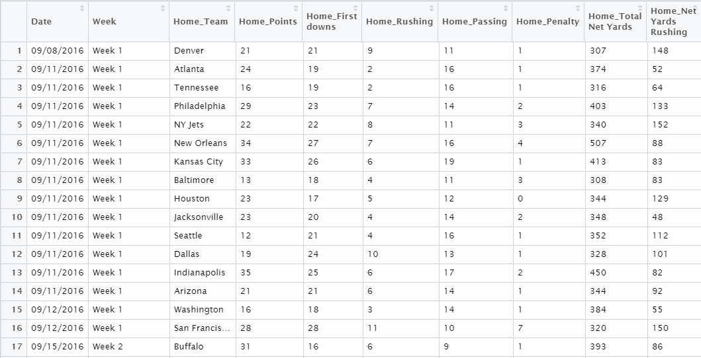
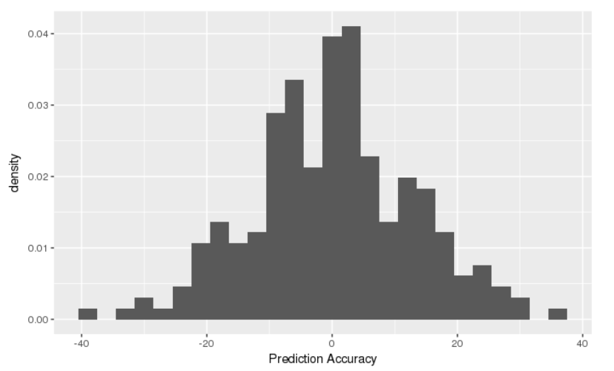
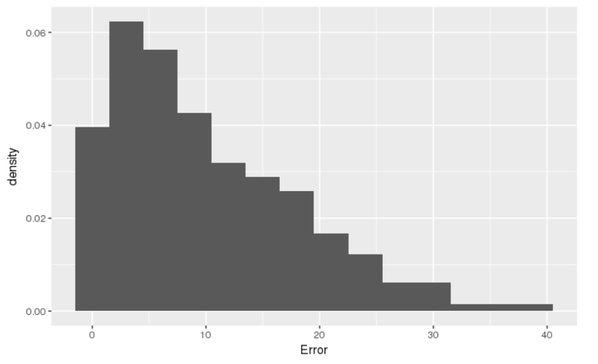
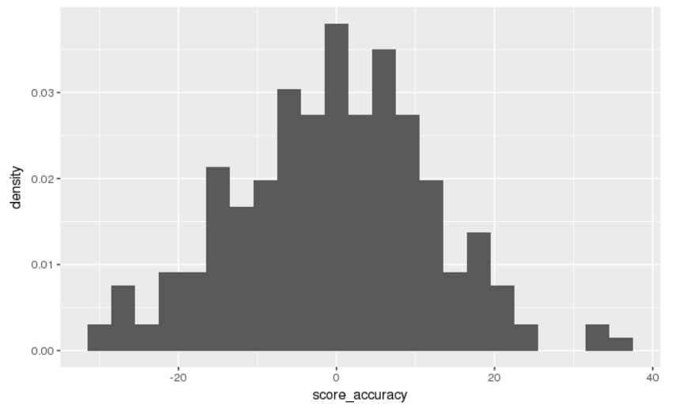
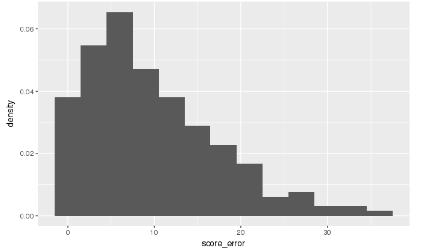
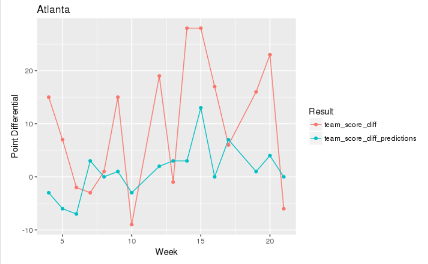
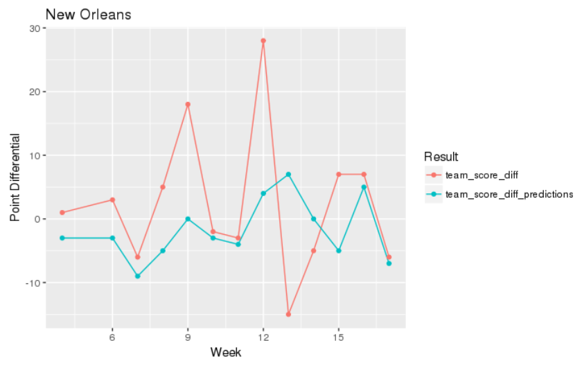
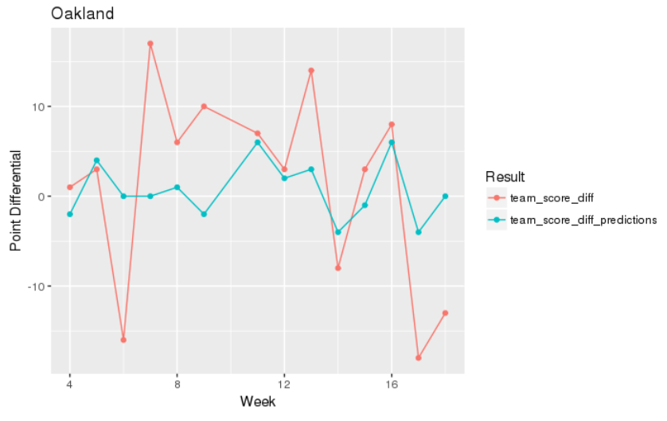

```{r setup, include=FALSE}
library(tufte)
# invalidate cache when the tufte version changes
knitr::opts_chunk$set(tidy = FALSE, cache.extra = packageVersion('tufte'))
options(htmltools.dir.version = FALSE)
```


#Introduction/Motivation
American Football is a dynamic sport, anything can happen. At any moment, there are 22 players on the field playing different positions to reach one of thousands of objectives, and millions of results may be attained. Beyond all of this variety, it is one of America's favorite sports to watch and to try and predict. Predicting football outcomes is no easy task, but we were excited about the challenge and decided to try our hand at it. We took particular interest in attempting to model the score differential of NFL games, using distinct team offensive and defensive score stats that we calculated. We were specifically interested in seeing if these summary score statistics would act as effective predictors. Choosing to do a project like this was easy, because we are both big fans of the sport. If you wanted to see how we did, or to hear more about our methods, models, and findings, read on!


The literature that guided our work for the creation of the models was an article from the journal of Applied Statistics titled *Bayesian hierarchical model for the prediction of football results* by Gianluca Baio and Marta Blangiardo. This article was our primary building block for our model structure. Athough Baio and Blangiardo modeled regular football (soccer) scores, many of their ideas were transferable with a few modifications. They used a model called a Poisson log-normal, where the score $y_{jg}|\theta_{jg}$ was distributed based on a rate for each teams scoring ability $\theta_i$ in each of the two times they played $g$. These rates are then logged equations of similar offensive and defensive ability scores, each of which are normally distributed. They found their score predictions to be fairly accurate for the football clubs analyzed.

# Methods
Initially, we had to look at whether we wanted to work with team or individual stats. Given that individual stats were much more difficult to find and would include some obsolete info for non-skill players, we chose to work with team statistics. This created a contextualization problem of relating team stats to points scored. The solution came in the OD (offensive defensive) score model. The way this model works, is the offensive score of a team over a season is the sum of the ratio between all the points they score, and the points they allowed to be scored on them in each game. This set up helps to balance out an overweighted score from scoring a lot against a team that typically gives up a lot of points. The defensive scores are calculated the same way, as seen below. 
$$
o_{i,t} = \frac{s_{i,1}}{d_{1,t-1}} + \frac{s_{i,2}}{d_{2,t-1}} + \dots + \frac{s_{i,n}}{d_{n,t-1}} \\
d_{i,t} = \frac{s_{i,1}}{o_{1,t}} + \frac{s_{i,2}}{o_{n,t}} + \dots + \frac{s_{i,n}}{o_{n,t}} \\
\text{These scores can be updated with each new additional game as they hold the relationship} \\
o_t = A (1/d_{t-1}) \\
d_t = A (1/o_t) \\
$$


# The Data
A significant portion of this project was trying to get the data we want, in a way in which it was useful to use. It all started with scraping sections of two web pages from The Football Data Base website (www.footballdb.com). We scraped the data with R using the (xm12) package and the (rvest) packages. We used a google chrome extention called selector gadget to highlight the CSS code. In order to obtain game data beyond the boxscores, we found a pattern listed in the url of these pages that was organized by date and game number. From there we were able to loop in and go through and scrape those pages efficiently. We created a vector for the home and away data, and then compiled all the information into a dataframe. This worked effectively for every year except 2017, while the method should work with incomplete seasons, footballdb had some errors in their url date code that led us to Canadian football on one occasion. Thus, this project will not include 2017 data, but will include data from 2011 to 2016. All of this code was made in a function format so that we could input what year of data and we would recieve that year. R packages (dplyr) (tidyr) and (lubridate) were all necessary for acquiring the data. Table 1 below shows the first few columns of our raw data.

The second step of this process was Data wrangling. We needed to take the raw statistics scraped from the site, and transform them into the data we wanted to use. This was an extensive step that came in two shifts. The first was to make sure all the data was usable and that our data set only included variable statistics that we wanted. This included changing numeric stats to numeric values, breaking completion/attempts stats into attempts and completions separately, and obtaining correct week numbers including post season games, to name a few. The second shift was the formation of our Offensive and Defensive score statistics from the cleaned data. This was a detailed task that included mapping each team's offensive stats to the identified offensive team, and all defensive stats to the identified defensive team.

##Table 1: Raw Data 



#Models & Results
After we had aquired and modified the data to our likeing, we began to construct some models that would best predict the score differential of an NFL game using rstudio's (rjags) package. Our models took on a Baysian approach, where we took prior understanding of some of our parameters to try and predict what the output may be, and adjusted that understanding with each new addition of data to the model. Our most basic model structure is similar to the literature by Baio and Blangiardo, we chose a Poisson model so that we can take a rate of points scored in a game, and record a count of points from it. However for Poisson models, the $E(\lambda)=Var(\lambda)$ and this does not reflect results that are accurate in variance. To solve this, we logged the $\lambda$ equation. Additionally, each of our models was trained on data from the 2011 to 2015 NFL seasons, before being tested on the 2016 season. For reference, Tables 2 and 3 below will provide a brief summary for each variable and parameter used in our models.

##Table 2: Variable Values   
Variable                  |  Definition
------------------------  |  ----------------------------------------------
$y_{hi}$                  |  Home team final points scored in game i 
$y_{ai}$                  |  Away team final points scored in game i
$w_i$                     |  Binned weeks dividing each season into 3 uneven sections (early, mid, and late season
$hO_i$                    |  Home team's offensive score stat in game i
$hD_i$                    |  Home team's defensive score stat in game i
$aO_i$                    |  Away team's offensive score stat in game i
$aD_i$                    |  Away team's defensive score stat in game i
$hO_{i(y-1)}$             |  Home team's offensive score stat from last year
$hD_{i(y-1)}$             |  Home team's defensive score stat from last year
$aO_{i(y-1)}$             |  Away team's offensive score stat from last year
$aD_{i(y-1)}$             |  Away team's defensive score stat from last year

##Table 3: Perameters         
Parameter            |  Definition
-------------------- |  ---------------------------------------------------------------------
$h\lambda_i$         |  The rate at which the home team scores points in a game i
$a\lambda_i$         |  The rate at which the away team scores points in a game i
$\beta_{1t}$         |  The weighting coefficient used to represent the relationship between the rate of points scored in game i                         and the difference of the offensive team score and the defensive team score. Weighted in higher models
$\beta_{2t}$         |  The weighting coefficient used to represent the relationship between the rate of points scored in game i                         and the difference of the home team's previous year offensive team score and the away team's previous                           year defensive team score. Weighted in higher models. 
$\beta_0$            |  The parameter which lists the logged y-intercept, or a base rate which points are scored if all                                 variables =0
$h_0$                |  The parameter which implements a home field advantage


##Model 1
Starting with this Bayesian structure, we came up with our first model:
$$
y_{hit}|h\lambda_{it},\beta_0,\beta_1,\beta_2,h_0 \sim Pois(h\lambda_{i}) \\
y_{ait}|a\lambda_{it},\beta_0,\beta_1,\beta_2 \sim Pois(a\lambda_i) \\
log(h\lambda_{it}) = \beta_0 + h_0 + \beta_{1}(hO_{it} - aD_{it}) \\
log(a\lambda_{it}) = \beta_0  + \beta_{1}(aO_{it} - hD_{it})  \\
\beta_0,h_0 \sim N(0,10) \\
\beta_{1} \sim N(1,10)  \\
$$
This model implies our basic model principles and looks at the logged rates $h\lambda$ and $a\lambda$ where they are being determined based on the difference of home and away team's offensive and defensive scores. Additionally, the coefficients $\beta0,\beta1, \text{and}\; h0$ all have very basic normally distributed priors, which allow for a greater majority of our understanding to come from the data we recieve. This model is considered our basic model because it only looks at a team's production over the course of the season, there is not much else accounted for as far as how good were they last year, or how they have improved or faltered since the begining of the season.

The results of our first model in Table 4 show how all of our parameters are in fact positvely correlated, but none of them look to hold any significance. When comparing our predictions to the actual outcomes of the games, we notice that our average prediction error was 10.10 points. As can be seen in Figures 1 and 2, wich show the spread of our predictions and the distribution of the prediction error, there are still a few games we missed by as much as 20 or even 40 on occasion. We looked to clean this up a bit in our next model.


##Table 4: Model One Summary Stats

               2.5%       25%        50%       75%        97.5%
----------- ---------- ---------- ---------- ---------- ----------
 $\beta_0$     3.05       3.06      3.06       3.07       3.08   
 $\beta_1$     1.35       1.50      1.58       1.65       1.80 
 $h_0$         0.10       0.11      0.12       0.12       0.013
 
##Figure 1


##Figure 2



##Model 2
In our second model, we added two new $\beta_2$ parameters as well as pieces to our equation that would account for the team's performance incorporating last years OD score stats.
$$
y_{hit}|h\lambda_{it},\beta_0,\beta_1,\beta_2,h_0 \sim Pois(h\lambda_{i}) \\
y_{ait}|a\lambda_{it},\beta_0,\beta_1,\beta_2 \sim Pois(a\lambda_i) \\
log(h\lambda_{it}) = \beta_0 + h_0 + \beta_{1}(hO_{it} - aD_{it}) 
 + \beta_{2}(hO_{i(y-1)} - aD_{i(y-1)}) \\
log(a\lambda_{it}) = \beta_0  + \beta_{1}(aO_{it} - hD_{it})  
 + \beta_{2}(aO_{i(y-1)} - hD_{i(y-1)}) \\
\beta_0,h_0 \sim N(0,10) \\
\beta_{1},\beta_{2} \sim N(1,10)
$$
We felt this was a decent addition to the model because it now allowed us to see more team progression. If a team was historically bad last year, that may have an affect on how their team would perform coming into the next season. We simply mirrored the OD score difference between the home and away teams', offensive and defensive scores' from the current scores and added in a second one for their scores at the end of the last season. All prior distributions and external structure was kept from Model 1.
 
Looking at Model 2's results, we can see that the additional $\beta_2$ parameter on the historical team OD scores was significant. However, our average prediction error only fell to about 9.75 points. This is not a super significant change, but it does reflect that our decision to add in historic team data was a good one.

##Table 5: Model Two Summary Stats
               2.5%       25%        50%       75%        97.5%
----------- ---------- ---------- ---------- ---------- ----------
 $\beta_0$     3.05       3.06      3.06       3.06       3.07   
 $\beta_1$     1.04       1.21      1.29       1.37       1.52 
 $\beta_2$    10.59      11.25     11.60      11.96      12.63
 $h_0$         0.10       0.11      0.11       0.12       0.013


##Figure 3
 

##Figure 4


##Model 3
For our final model, we made one more addition from Model 2 that would help measure how a team progresses throughout the season. By introducing a weight distribution for each $\beta_1$ and $\beta_2$  that would be normally distributed based on what part of the season they were in $t\in(1:3).
$$
y_{hit}|h\lambda_{it},\beta_0,\beta_1,\beta_2,h_0 \sim Pois(h\lambda_{i}) \\
y_{ait}|a\lambda_{it},\beta_0,\beta_1,\beta_2 \sim Pois(a\lambda_i) \\
log(h\lambda_{it}) = \beta_0 + h_0 + \beta_{1b_t}(hO_{it} - aD_{it}) 
 + \beta_{2b_t}(hO_{i(y-1)} - aD_{i(y-1)}) \\
log(a\lambda_{it}) = \beta_0  + \beta_{1b_t}(aO_{it} - hD_{it})  
 + \beta_{2b_t}(aO_{i(y-1)} - hD_{i(y-1)}) \\
\beta_0,h_0 \sim N(0,10) \\
\beta_{1t},\beta_{2t} \sim N(1,10) \; \text{for}\; b_t \in (1,3)
$$
This addition to the model was worthwhile because now, the rate of scoring is influenced by the OD scores from the current and past seasons, at varying parts of the season. When $\beta_1$ and $\beta_2$ are weighted for season section $t$, the predictions are able to reflect if a team's ability to score points is greater or worse at a specific part of a season, or even season to season, with the Model 2 addition. This inclusion of team trend seemed like a great addition to create our final model.

Looking at the results of our MCMC model generation. We can see evidence of what we were looking for in our Model 3. The $\beta_1$'s show more and more significance as the current season plays out, while the $\beta_2$'s show less significance as the season plays out. This is to be expected because our model relied heavily on last years OD scores when making predictions early in the season, but as the season went on, turned more towards the current trending OD scores. The average prediction error for this model only fell to 9.73 points. This wasn't significantly greater than our Model 2 result, but still managed to show improvement.

##Table 6: Model Three Summary Stats
                  2.5%       25%        50%       75%        97.5%
-------------- ---------- ---------- ---------- ---------- ----------
 $\beta_0$         3.04       3.05      3.05       3.06       3.07   
 $\beta_{1,1}$     0.27       0.46      0.56       0.66       0.85 
 $\beta_{1,2}$     5.93       6.85      7.35       7.85       8.82
 $\beta_{1,3}$    13.94      14.87     15.35      15.83      16.77
 $\beta_{2,1}$     8.96      10.39     11.14      11.89      13.32
 $\beta_{2,2}$     8.31       9.51     10.18      10.84      12.06
 $\beta_{2,3}$     2.95       3.91      4.40       4.92       5.93
 $h_0$             0.10       0.11      0.11       0.12       0.13


##Figure 5
 

##Figure 6


Additional results we wanted to look at for this final model was how the predictions of point spreads vs actual outcomes turn out when looking at specific teams. Here's some of what we found:
##Figure 7

For Chicago, the predictions were fairly stable and consistant throughout, but there was a string of blowouts over the season that through our accuracy off.

##Figure 8


In Atlanta's case, they were not very good in previous years, so their predictions were low. But they won many of their early games, many by blowouts. They would eventually move on to play in the Super Bowl this year, but it is worth noting here how our model was able to increase predictions based on the season performance.

##Figure 9


New Orleans demonstrates how our model does in theory, we were very close on predicting many of the games, but there were a few unanticipated blowout games that shook up the overall results.

##Figure 10


Looking at Oaklands data, we can see that the predictions were decent (with the exception of a few blowouts) in the early to middle part of the season, but after week 16, Oakland's best offensive player got injured. Our model is not accustomed to react fast enough to this shock and thus predicted a much closer margin than the actual results for the remaining games.


# Limitations
While we did see some improvement in our modeling, and managed to generate prediction spreads of less than 10 points on average, there is still a lot  we could improve upon it. One of the primary limitations of this model is the limited data. With a model such as this, you need to be pulling target points from a far greater number of sources than just a few years worth of games. With the NFL only being 32 teams, and only playing a regular season of 16 games, it is difficult to get an effective quanitity of data. Adding additional parameters is also an improvement that is handcuffed by the lack of availability. There are only so many parameters we can include in which we have enough data to represent them effectively.

Additionally, as we saw across the results section, our model is very slow to respond to major shocks such as injury. This is very difficult to model, as is trying to represent the playmaking ability of a team or player that would contribute to a blowout game. These aspects of the sport are what make it so difficult for anyone to model in the first place. These are the parts of our model that if we could simply look to limit, we would improve our predictions greatly.

Finally, our model does not account for the changes that occur within teams from season to season. Many players may retire, switch teams, and new prodigies may be drafted. The entire dynamic of a team could change in an offseason. While we did incorporate a way to inlude past years team stats into current day projections, the model will not make significant adjustments to this quick enough.

#Whats next
Given the opportunity to continue this research and work more with this data to develop even better prediction models, there are a few things we would like to explore to either make the model just a little bit better, or satisfy our own curiosity about the model or the data. One of the first things we would do is look to modify the priors used in each of our models. Many of these priors are very generic and, thus, weighted heavily on the data for its predictability. Ideally there would be some greater research or intuition there to experiment and find a more solid prior distribution. Another thing we would like to do is see how this model predicts the score differential of other sports. Most sports have some sort of attack and defense aspect that can be modeled with the OD model system. Theoretically, this should be applicable to any sport.


#Bibliography

##Literature
Gianluca Baio and Marta Blangiardo, *Bayesian hierarchical model for the prediction of football results*, journal of Applied Statistics, Vol. 37, No. 2, February 2010, 253–264, November 2017.

##Rstudio Packages
library(xml2)
library(rvest)
library(tidyr)
library(dplyr)
library(ggplot2)
library(lubridate)
library(readr)
library(igraph)
library(rjags)

##Data Sources
www.footballdb.com

##Other
Google Chrome Selector Gadget


#Apendix and Code


The Tufte handout style is a style that Edward Tufte uses in his books and handouts. Tufte's style is known for its extensive use of sidenotes, tight integration of graphics with text, and well-set typography. This style has been implemented in LaTeX and HTML/CSS^[See Github repositories [tufte-latex](https://github.com/tufte-latex/tufte-latex) and [tufte-css](https://github.com/edwardtufte/tufte-css)], respectively. We have ported both implementations into the [**tufte** package](https://github.com/rstudio/tufte). If you want LaTeX/PDF output, you may use the `tufte_handout` format for handouts, and `tufte_book` for books. For HTML output, use `tufte_html`. These formats can be either specified in the YAML metadata at the beginning of an R Markdown document (see an example below), or passed to the `rmarkdown::render()` function. See @R-rmarkdown more information about **rmarkdown**.

```yaml
---
title: "An Example Using the Tufte Style"
author: "John Smith"
output:
  tufte::tufte_handout: default
  tufte::tufte_html: default
---
```

There are two goals of this package:

1. To produce both PDF and HTML output with similar styles from the same R Markdown document;
1. To provide simple syntax to write elements of the Tufte style such as side notes and margin figures, e.g. when you want a margin figure, all you need to do is the chunk option `fig.margin = TRUE`, and we will take care of the deails for you, so you never need to think about `\begin{marginfigure} \end{marginfigure}` or `<span class="marginfigure"> </span>`; the LaTeX and HTML code under the hood may be complicated, but you never need to learn or write such code.

If you have any feature requests or find bugs in **tufte**, please do not hesitate to file them to https://github.com/rstudio/tufte/issues. For general questions, you may ask them on StackOverflow: http://stackoverflow.com/tags/rmarkdown.

# Headings

This style provides first and second-level headings (that is, `#` and `##`), demonstrated in the next section. You may get unexpected output if you try to use `###` and smaller headings.

`r newthought('In his later books')`^[[Beautiful Evidence](http://www.edwardtufte.com/tufte/books_be)], Tufte starts each section with a bit of vertical space, a non-indented paragraph, and sets the first few words of the sentence in small caps. To accomplish this using this style, call the `newthought()` function in **tufte** in an _inline R expression_ `` `r ` `` as demonstrated at the beginning of this paragraph.^[Note you should not assume **tufte** has been attached to your R session. You should either `library(tufte)` in your R Markdown document before you call `newthought()`, or use `tufte::newthought()`.]

# Figures

## Margin Figures

Images and graphics play an integral role in Tufte's work. To place figures in the margin you can use the **knitr** chunk option `fig.margin = TRUE`. For example:

```{r fig-margin, fig.margin = TRUE, fig.cap = "MPG vs horsepower, colored by transmission.", fig.width=3.5, fig.height=3.5, cache=TRUE}
library(ggplot2)
mtcars2 <- mtcars
mtcars2$am <- factor(
  mtcars$am, labels = c('automatic', 'manual')
)
ggplot(mtcars2, aes(hp, mpg, color = am)) +
  geom_point() + geom_smooth() +
  theme(legend.position = 'bottom')
```

Note the use of the `fig.cap` chunk option to provide a figure caption. You can adjust the proportions of figures using the `fig.width` and `fig.height` chunk options. These are specified in inches, and will be automatically scaled down to fit within the handout margin.

## Arbitrary Margin Content

In fact, you can include anything in the margin using the **knitr** engine named `marginfigure`. Unlike R code chunks ```` ```{r} ````, you write a chunk starting with ```` ```{marginfigure} ```` instead, then put the content in the chunk. See an example on the right about the first fundamental theorem of calculus.

```{marginfigure}
We know from _the first fundamental theorem of calculus_ that for $x$ in $[a, b]$:
$$\frac{d}{dx}\left( \int_{a}^{x} f(u)\,du\right)=f(x).$$
```

For the sake of portability between LaTeX and HTML, you should keep the margin content as simple as possible (syntax-wise) in the `marginefigure` blocks. You may use simple Markdown syntax like `**bold**` and `_italic_` text, but please refrain from using footnotes, citations, or block-level elements (e.g. blockquotes and lists) there.

## Full Width Figures

You can arrange for figures to span across the entire page by using the chunk option `fig.fullwidth = TRUE`.

```{r fig-fullwidth, fig.width = 10, fig.height = 2, fig.fullwidth = TRUE, fig.cap = "A full width figure.", warning=FALSE, cache=TRUE}
ggplot(diamonds, aes(carat, price)) + geom_smooth() +
  facet_grid(~ cut)
```

 Other chunk options related to figures can still be used, such as `fig.width`, `fig.cap`, `out.width`, and so on. For full width figures, usually `fig.width` is large and `fig.height` is small. In the above example, the plot size is $10 \times 2$.

## Main Column Figures

Besides margin and full width figures, you can of course also include figures constrained to the main column. This is the default type of figures in the LaTeX/HTML output.

```{r fig-main, fig.cap = "A figure in the main column.", cache=TRUE}
ggplot(diamonds, aes(cut, price)) + geom_boxplot()
```

# Sidenotes

One of the most prominent and distinctive features of this style is the extensive use of sidenotes. There is a wide margin to provide ample room for sidenotes and small figures. Any use of a footnote will automatically be converted to a sidenote. ^[This is a sidenote that was entered using a footnote.] 

If you'd like to place ancillary information in the margin without the sidenote mark (the superscript number), you can use the `margin_note()` function from **tufte** in an inline R expression. `r margin_note("This is a margin note.  Notice that there is no number preceding the note.")` This function does not process the text with Pandoc, so Markdown syntax will not work here. If you need to write anything in Markdown syntax, please use the `marginfigure` block described previously.

# References

References can be displayed as margin notes for HTML output. For example, we can cite R here [@R-base]. To enable this feature, you must set `link-citations: yes` in the YAML metadata, and the version of `pandoc-citeproc` should be at least 0.7.2. You can always install your own version of Pandoc from http://pandoc.org/installing.html if the version is not sufficient. To check the version of `pandoc-citeproc` in your system, you may run this in R:

```{r eval=FALSE}
system2('pandoc-citeproc', '--version')
```

If your version of `pandoc-citeproc` is too low, or you did not set `link-citations: yes` in YAML, references in the HTML output will be placed at the end of the output document.

# Tables

You can use the `kable()` function from the **knitr** package to format tables that integrate well with the rest of the Tufte handout style. The table captions are placed in the margin like figures in the HTML output.

```{r}
knitr::kable(
  mtcars[1:6, 1:6], caption = 'A subset of mtcars.'
)
```

# Block Quotes

We know from the Markdown syntax that paragraphs that start with `>` are converted to block quotes. If you want to add a right-aligned footer for the quote, you may use the function `quote_footer()` from **tufte** in an inline R expression. Here is an example:

> "If it weren't for my lawyer, I'd still be in prison. It went a lot faster with two people digging."
>
> `r tufte::quote_footer('--- Joe Martin')`

Without using `quote_footer()`, it looks like this (the second line is just a normal paragraph):

> "Great people talk about ideas, average people talk about things, and small people talk about wine."
>
> --- Fran Lebowitz

# Responsiveness

The HTML page is responsive in the sense that when the page width is smaller than 760px, sidenotes and margin notes will be hidden by default. For sidenotes, you can click their numbers (the superscripts) to toggle their visibility. For margin notes, you may click the circled plus signs to toggle visibility.

# More Examples

The rest of this document consists of a few test cases to make sure everything still works well in slightly more complicated scenarios. First we generate two plots in one figure environment with the chunk option `fig.show = 'hold'`:

```{r fig-two-together, fig.cap="Two plots in one figure environment.", fig.show='hold', cache=TRUE}
p <- ggplot(mtcars2, aes(hp, mpg, color = am)) +
  geom_point()
p
p + geom_smooth()
```

Then two plots in separate figure environments (the code is identical to the previous code chunk, but the chunk option is the default `fig.show = 'asis'` now):

```{r fig-two-separate, ref.label='fig-two-together', fig.cap=sprintf("Two plots in separate figure environments (the %s plot).", c("first", "second")), cache=TRUE}
```

You may have noticed that the two figures have different captions, and that is because we used a character vector of length 2 for the chunk option `fig.cap` (something like `fig.cap = c('first plot', 'second plot')`).

Next we show multiple plots in margin figures. Similarly, two plots in the same figure environment in the margin:

```{r fig-margin-together, fig.margin=TRUE, fig.show='hold', fig.cap="Two plots in one figure environment in the margin.", fig.width=3.5, fig.height=2.5, cache=TRUE}
p
p + geom_smooth(method = 'lm')
```

Then two plots from the same code chunk placed in different figure environments:

```{r fig-margin-separate, fig.margin=TRUE, fig.cap=sprintf("Two plots in separate figure environments in the margin (the %s plot).", c("first", "second")), fig.width=3.5, fig.height=2.5, cache=TRUE}
knitr::kable(head(iris, 15))
p
knitr::kable(head(iris, 12))
p + geom_smooth(method = 'lm')
knitr::kable(head(iris, 5))
```

We blended some tables in the above code chunk only as _placeholders_ to make sure there is enough vertical space among the margin figures, otherwise they will be stacked tightly together. For a practical document, you should not insert too many margin figures consecutively and make the margin crowded. 

You do not have to assign captions to figures. We show three figures with no captions below in the margin, in the main column, and in full width, respectively.

```{r fig-nocap-margin, fig.margin=TRUE, fig.width=3.5, fig.height=2, cache=TRUE}
# a boxplot of weight vs transmission; this figure
# will be placed in the margin
ggplot(mtcars2, aes(am, wt)) + geom_boxplot() +
  coord_flip()
```
```{r fig-nocap-main, cache=TRUE}
# a figure in the main column
p <- ggplot(mtcars, aes(wt, hp)) + geom_point()
p
```
```{r fig-nocap-fullwidth, fig.fullwidth=TRUE, fig.width=10, fig.height=3, cache=TRUE}
# a fullwidth figure
p + geom_smooth(method = 'lm') + facet_grid(~ gear)
```

# Some Notes on Tufte CSS

There are a few other things in Tufte CSS that we have not mentioned so far. If you prefer `r sans_serif('sans-serif fonts')`, use the function `sans_serif()` in **tufte**. For epigraphs, you may use a pair of underscores to make the paragraph italic in a block quote, e.g.

> _I can win an argument on any topic, against any opponent. People know this, and steer clear of me at parties. Often, as a sign of their great respect, they don't even invite me._
>
> `r quote_footer('--- Dave Barry')`

We hope you will enjoy the simplicity of R Markdown and this R package, and we sincerely thank the authors of the Tufte-CSS and Tufte-LaTeX projects for developing the beautiful CSS and LaTeX classes. Our **tufte** package would not have been possible without their heavy lifting.

To see the R Markdown source of this example document, you may follow [this link to Github](https://github.com/rstudio/tufte/raw/master/inst/rmarkdown/templates/tufte_html/skeleton/skeleton.Rmd), use the wizard in RStudio IDE (`File -> New File -> R Markdown -> From Template`), or open the Rmd file in the package:

```{r eval=FALSE}
file.edit(
  tufte:::template_resources(
    'tufte_html', '..', 'skeleton', 'skeleton.Rmd'
  )
)
```

```{r bib, include=FALSE}
# create a bib file for the R packages used in this document
knitr::write_bib(c('base', 'rmarkdown'), file = 'skeleton.bib')
```
